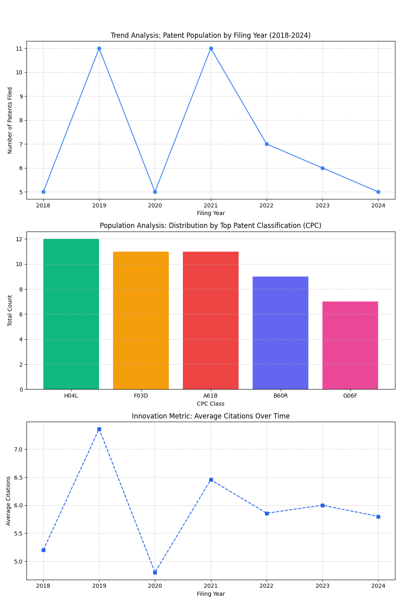

# Innovation Patent AI Evaluation Report

## A. Input Patent Details
- **Title:** Novel Graphene-Based Quantum Battery Architecture
- **Input Source File Path:** input_patent.txt
- **Evaluation Date:** 2026-03-23 11:18:41

## B. Novelty and Innovation Assessment (Simulated LLM)

### Novelty Score
- **Overall Score (0-100):** **40.0**

### Conservation Analysis (Qualitative Assessment)
*This section provides a high-level, human-readable summary of the invention's potential, simulating the output of a large-scale LLM analysis.*

> Lower Novelty Risk. The description, while clear, appears closely aligned with existing, well-cited technologies. The scope of claims may be narrow, requiring a deeper search for similar prior art.

---

## C. Similarity and Prior Art Analysis

### Novelty Gap
- **Novelty Gap Score (1.0 = Highly Novel):** **0.606**
- **Interpretation:** This score represents how far the invention is from the most similar existing patent in the corpus. A score closer to $1.0$ indicates greater novelty and a lower risk of obviousness.

### Most Similar Patents (Prior Art)
*The following patents from the corpus exhibit the highest semantic similarity to the input invention, calculated using Cosine Similarity on Sentence Embeddings.*

| Similarity Score | Patent ID | Title |
|:----------------:|:---------:|:------|
| 0.3941 | US201900011 | Solar panel efficiency booster using graphene oxide (11) |
| 0.3922 | US202200033 | Solar panel efficiency booster using graphene oxide (33) |
| 0.3857 | US202100020 | Solar panel efficiency booster using graphene oxide (20) |
| 0.3820 | US201900039 | Solar panel efficiency booster using graphene oxide (39) |
| 0.1352 | US202000034 | AI-driven dynamic energy allocation system (34) |

---

## D. Protection Recommendations

### Recommended Scope Strategy
**Intermediate Scope:** Novelty exists in the combination of features. Claims should focus on the unique integration points identified in the abstract and ensure that all existing similar patents are explicitly differentiated in the final claim language.

---

## E. Population Analysis Trends Visualization

*The following image provides an overview of the patent landscape (population) based on the current corpus data, illustrating the time-series trends requested.*

